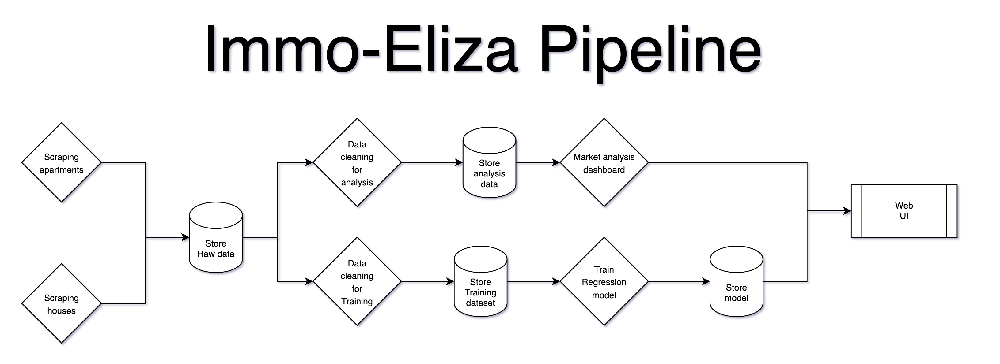

# ImmoEliza Pipeline

- Type of challenge: Consolidation
- Duration: `5 days`
- Deadline : `20/12/24 4:30 PM`
- Team challenge: Group project

## Mission objectives
- Collaborate effectively using ticketing systems like Trello
- Build a fully automated pipeline that runs on a schedule using Airflow
- Refactor previous code into DAGS
- Be able to install & run Airflow in a local environment and using Docker.

## The Mission
After your ImmoEliza project, the is quite happy with the results and wants to implement your solution at the company level. As they are growing, they are interested in gathering historical data of the housing market in an automated way. The company asks your team to develop a pipeline to automate their work. The goal is simple: They want to monitor their famous competitor: ImmoWeb.

Here are the tasks:
- Scrape housing data for sales every night 
- Train a regression model and evaluate its performance.
- Update your API/streamlit app with the new data

 Figure: Sample pipeline

## Constrains:

- Your datasets need to be versioned.
- Your models need to be versioned.
- You will need to apply a different pre-processing for analyzing data and for training models.

## Deliverables

1. **GitHub Repository:** Include all source code.
2. **Trello Board:** Share with the team and coach.
3. **Show and Tell:** Summarize your approach/findings in an engaging format (PDF or other). One member of the team will present the teams findings on Friday during a 5 minutes presentation.

## Steps

1. Study the brief: 
    - What will you deliver as a solution to your user (a notebook, presentation, scripts)?
2. Assign team roles:
    - Team Lead: Point of contact of coach,and lead in disussions
    - Repo Manager: Creates and manages the repo
    - Presenter:  Communicates findings 
3. Identify technical challenges: How?
    - Who's code will be use as the main code base?
    - Create a list of tasks and assign them to team members
    - Discuss a proposed workflow (inputs/outputs) and how you will communicate as a team
4. Create the repository
    - Decide: branches or folders?
    - Decide: Github workflow
    

6. Create a DAG for each section of the pipeline
7. Test your pipeline  by running it inside a Docker container
8. Finalize your repo, README, and present results

## Deliverables

1. Publish your source code on the GitHub repository.
2. Pimp up the README file:
   - Description
   - Installation
   - Usage
   - ⚠️ **DATA SOURCES**
   - (Visuals)
   - (Contributors)
   - (Timeline)
   - (Personal situation)
3. Small 5 minutes presentation

## You got this! 💪

